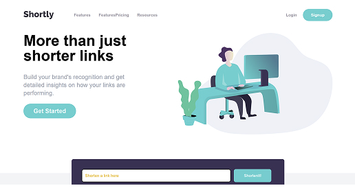

# Frontend Mentor - Shortly URL shortening API Challenge solution

This is a solution to the [Shortly URL shortening API Challenge challenge on Frontend Mentor](https://www.frontendmentor.io/challenges/url-shortening-api-landing-page-2ce3ob-G). Frontend Mentor challenges help you improve your coding skills by building realistic projects.

## Table of contents

- [Overview](#overview)
  - [The challenge](#the-challenge)
  - [Screenshot](#screenshot)
  - [Links](#links)
- [My process](#my-process)
  - [Built with](#built-with)
  - [What I learned](#what-i-learned)
  - [Continued development](#continued-development)
  - [Useful resources](#useful-resources)
- [Author](#author)
- [Acknowledgments](#acknowledgments)

## Overview

### The challenge

Users should be able to:

- View the optimal layout for the site depending on their device's screen size
- Shorten any valid URL - tbd
- See a list of their shortened links, even after refreshing the browser - tbd
- Copy the shortened link to their clipboard in a single click - tbd
- Receive an error message when the `form` is submitted if: -tbd
  - The `input` field is empty

### Screenshot

Desktop view:

Mobile view:

### Links

- Github pages URL: [shortly website, github pages](https://pwtaberg.github.io/shortly-website/)

## My process

### Built with

- Semantic HTML5 markup
- CSS custom properties
- Mobile-first workflow
- Tailwind

### What I learned

The purpose of this project was to learn how to use tailwind

## Author

Peter Welliver

## Acknowledgments

Brad Traversy, tutorial
